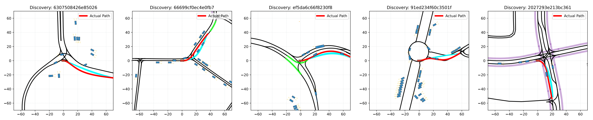
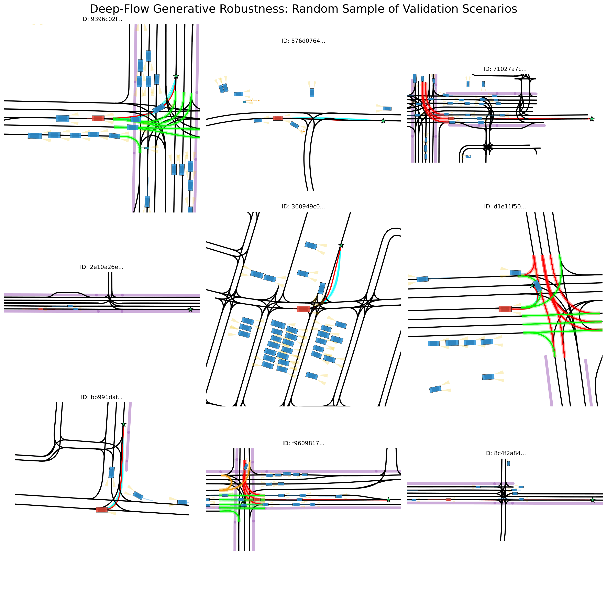
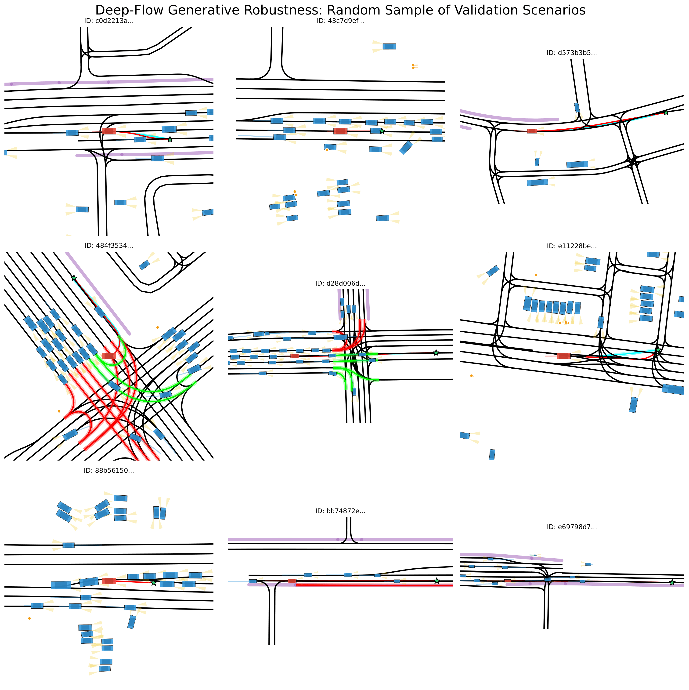
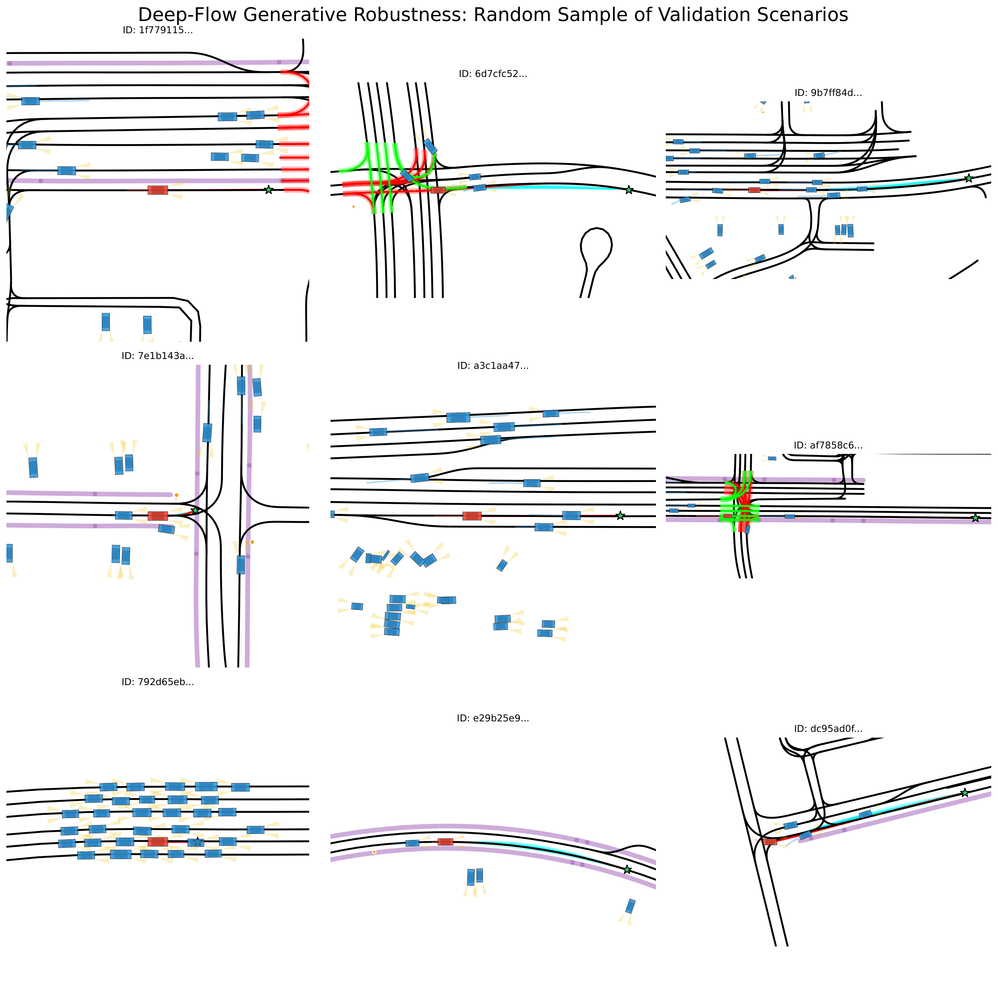

# Conditional Flow Matching for Continuous Anomaly Detection in Autonomous Driving

<p align="center">
  This repository contains the official PyTorch implementation of <strong>Deep-Flow</strong>, an unsupervised safety validation framework that utilizes <strong>Optimal Transport Conditional Flow Matching (OT-CFM)</strong> to characterize the continuous probability density of expert human behavior on the Waymo Open Motion Dataset.
</p>

<p align="center">
  <a href="https://arxiv.org/abs/2602.17586" target="_blank">
    
  </a>
  <a href="https://github.com/AntonioAlgaida/FlowMatchingTrajectoryAnomaly" target="_blank">
    
  </a>
  <a href="LICENSE">
    
  </a>
  <a href="https://pytorch.org/">
    
  </a>
  
</p>

<p align="center">
  A project by <strong>Antonio Guillen-Perez</strong> | 
  <a href="https://antonioalgaida.github.io/" target="_blank"><strong>Portfolio</strong></a> | 
  <a href="https://www.linkedin.com/in/antonioguillenperez/" target="_blank"><strong>LinkedIn</strong></a> | 
  <a href="https://scholar.google.com/citations?user=BFS6jXwAAAAJ" target="_blank"><strong>Google Scholar</strong></a>
</p>


---

## 1. Key Result: The Generative Safety Filter
Deep-Flow identifies safety-critical anomalies by mapping observed trajectories into a learned probability manifold. By integrating the flow backwards ($t=1 \to 0$), we compute an **Exact Log-Likelihood** score. Nominal behaviors map to high-density regions of a Gaussian prior, while anomalies land in the low-probability tails.

<p align="center">
  
</p>
<p align="center">
  <em><b>Figure 1: Deep-Flow Framework Overview.</b> (Left) Observed trajectories in context. (Center) Projection into a 12D Spectral Manifold with a learned vector field. (Right) Mapping to a Gaussian prior for rigorous anomaly scoring.</em>
</p>

## 2. Project Mission
The "Long-Tail" problem in Level 4 autonomous vehicle validation remains a significant bottleneck. Traditional safety filters rely on brittle kinematic heuristics (e.g., hard braking) that fail to capture **semantic non-compliance** (e.g., lane violations, illegal turns). 

This project addresses this by shifting from rule-based detection to **Probabilistic Density Estimation**. The mission is to develop a mathematically rigorous "Safety Oracle" that learns the manifold of expert driving behavior and surfaces Out-of-Distribution (OOD) risks as a "Predictability Gap"—identifying scenarios that are kinematically safe but semantically erratic.

## 3. Technical Approach
The core of Deep-Flow is an **Optimal Transport Conditional Flow Matching** architecture operating on a **Spectral Manifold Bottleneck**.

1.  **Spectral Manifold (PCA-12):** To ensure kinematic smoothness and numerical stability, trajectories are projected into a 12D PCA coefficient space. This acts as a low-pass filter, forcing the model to focus on semantic intent rather than high-frequency sensor noise.
2.  **Early Fusion Encoder:** Fuses dynamic agent history and vectorized map geometry using a Transformer architecture inspired by *Wayformer*.
3.  **Lane-Aware Goal Conditioning:** A direct skip-connection injects the topological goal-lane directly into the flow head, resolving multi-modal ambiguity at junctions and roundabouts.
4.  **Optimal Transport Flow Matching:** Learns a deterministic vector field $v_\theta$ along straight-line probability paths, enabling faster convergence and easier ODE integration than Diffusion-based methods.
5.  **Exact Likelihood Estimation:** Leveraging the low-rank manifold, we compute the **Exact Jacobian Trace** via automatic differentiation, providing a deterministic, stable log-likelihood score for every scenario.
6.  **Kinematic Complexity Weighting:** A physics-informed loss weighting scheme based on **Tortuosity** and **Jerk Energy** ensures the model prioritizes learning rare maneuvers over routine cruising.

## 4. Repository Structure

```text
FlowMatchingTrajectoryAnomaly/
├── src/
│   ├── data_processing/   # Proto Parsing, PCA Basis & Stats
│   ├── dataset/           # Parallel Eager Loader & Kinematic Weighting
│   ├── models/            # SceneEncoder, FlowHead, DeepFlow wrapper
│   └── engine/            # Trainer, ODE Solver, Hybrid Losses
├── configs/               # Hydra Configuration Files
├── scripts/               # Entry points (train, eval, mine)
├── notebooks/             # Result Analysis & Paper Figure Generation
├── requirements.txt
└── README.md
```

## 5. Setup and Installation

This project uses `uv` for blazing-fast dependency management and environment isolation.

1.  **Clone the repository:**
    ```bash
    git clone https://github.com/AntonioAlgaida/FlowMatchingTrajectoryAnomaly.git
    cd FlowMatchingTrajectoryAnomaly
    ```

2.  **Initialize environment:**
    ```bash
    uv venv
    source .venv/bin/activate
    uv pip install -r requirements.txt
    ```

## 6. Data Preparation Pipeline

#### Step 1: Parse Raw WOMD Data
Extracts padded tensors from `.tfrecord` files to organized `.npz` shards.
```bash
uv run python src/data_processing/parser.py
```

#### Step 2: Compute Manifold & Stats
Generates the Spectral Basis (PCA) and normalization parameters.
```bash
uv run python src/data_processing/compute_pca.py
uv run python src/data_processing/compute_stats.py
```

## 7. Training
The trainer is optimized for high-throughput with 24GB VRAM and 64GB RAM systems.
```bash
uv run python scripts/run_train.py
```
*Note: The script includes a **Parallel Eager Loader** that caches the dataset into RAM, reducing per-epoch time from 15 mins to ~3 mins.*

## 8. Results and Analysis

### Quantitative Performance
Evaluated against a "Golden Test Set" of mined collisions and emergency braking events in the Waymo Open Motion Dataset.

| Metric | Heuristic Baseline | **Deep-Flow (Ours)** |
| :--- | :---: | :---: |
| **AUC-ROC** | 0.682 | **0.7660** |
| **Numerical Stability** | Low | **High (Deterministic)** |

### Anomaly Discovery (The "Discovery Engine")
Deep-Flow identifies complex semantic violations that escape rule-based filters. The following scenarios were identified as "False Positives" by heuristics but correctly flagged as "High Risk" by our model due to lane-boundary violations and non-normative geometry.

<p align="center">
  
</p>
<p align="center">
  <em><b>Figure 2: Discovery Engine.</b> The top 5 semantic anomalies identified by Deep-Flow, highlighting illegal maneuvers and corner-cutting.</em>
</p>

### Latent Manifold Visualization
The learned vector field exhibits strong convergence, "funneling" random noise into the specific expert maneuver required to reach the conditioned goal.

<p align="center">
  
</p>
<p align="center">
  <em><b>Figure 3: Latent Flow Dynamics.</b> Streamline visualization showing high-likelihood integration for nominal paths vs. high-resistance integration for anomalies.</em>
</p>

### Additional Visualizations

#### Appendix Gallery: Anomaly Examples

<p align="center">
  
</p>
<p align="center">
  <em><b>Figure 4a: Generative Robustness Gallery (1/3).</b> A random selection of validation scenarios. The model (Cyan bundles) demonstrates consistent lane adherence and goal convergence across various driving contexts, verifying that the learned vector field generalizes well beyond the training distribution.</em>
</p>

<p align="center">
  
</p>
<p align="center">
  <em><b>Figure 4b: Generative Robustness Gallery (2/3).</b> Additional validation scenarios showcasing the model's ability to handle complex interactions, such as merging and lane changes, while maintaining a coherent flow towards the goal.</em>
</p>

<p align="center">
  
</p>
<p align="center">
  <em><b>Figure 4c: Generative Robustness Gallery (3/3).</b> Final set of validation scenarios confirming the model's stability and reliability in diverse traffic situations, reinforcing its suitability for real-world safety validation.</em>
</p>

## 9. Future Work
- **Non-Linear Manifolds:** Replacing PCA with a VQ-VAE to capture high-curvature geometries (e.g., tight roundabouts).
- **Social Force Field:** Explicitly penalizing flow vectors that lead to agent-agent collisions.
- **SOTIF Safety Gates:** Deploying the LL threshold ($LL \approx 130$) as a real-time monitor for ODD containment.

## 10. Citation
```bibtex
@misc{guillen2026deepflow,
      title={Conditional Flow Matching for Continuous Anomaly Detection in Autonomous Driving on a Manifold-Aware Spectral Space}, 
      author={Antonio Guillen-Perez},
      year={2026},
      eprint={Coming Soon},
      archivePrefix={arXiv}
}
```

## Acknowledgements
Inspired by the "Simulation-Free" paradigm of [Lipman et al. (2023)](https://arxiv.org/abs/2210.02747) and the high-fidelity encoding strategies of [Wayformer](https://arxiv.org/abs/2207.05844).
